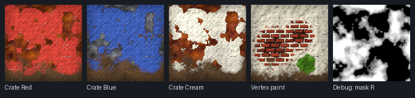

# Unreal Master Material - RGB masks + vertex painting

A complete, layered **Master Material for Unreal Engine 5**, written to match the *"VG - Master Material"*
assignment (3D-grafik: Avancerad: Spelmotor): tiling textures on one UV set, **RGB masks** (wear / dirt /
scratches / AO) on a second, unique UV set, **vertex painting** that paints other materials, a **mesh-decal**
master, and lots of artist-facing parameters so one material can produce many different looks.

You do not build the graph by hand: one Python script creates everything inside your Unreal project
(master, material functions, placeholder textures, demo textures, demo instances). Then you only make
**material instances** - exactly the workflow shown in the assignment images (red / blue / pink crates,
green / red / grey vault doors).

> **Honest status.** The script has been checked against the real Unreal 5.6 Python API *surface*
> (property names, enums, function signatures, struct constructors) and run end-to-end against a strict offline mock with
> 82 automated tests (wiring, maths, vertex painting, static switches, UV handling, re-runs, fallbacks), then reviewed twice
> independently (once for engine-API correctness, once for the shading logic against the brief) and corrected.
> It could **not** be opened inside the Unreal Editor in the environment where it was written, so a
> few engine details (see [Docs/07](Docs/07_Troubleshooting_and_Performance.md#if-the-script-fails-or-a-node-is-red))
> are unverified. The script has built-in fallbacks and prints clear messages; if something is red, the
> troubleshooting page tells you what to do.

---

## 1. Quick start (10 minutes)

1. **Enable Python:** *Edit > Plugins*, search "Python", tick **Python Editor Script Plugin**, restart the editor.
2. **Run the script:** *Tools > Execute Python Script...* (UE 4.x: *File >*) and pick
   [`Scripts/build_master_material.py`](Scripts/build_master_material.py).
   Alternative: open the **Output Log**, switch the input to **Cmd** and type `py "C:/full/path/build_master_material.py"`.
3. Wait 10-60 seconds. Watch the Output Log (filter on `MasterMaterial`). It ends with `DONE`.
4. Open **Content Browser > `MasterMaterial/`**:

   ```
   MasterMaterial/
     M_Master_Surface        <- THE master material (right-click > Create Material Instance)
     M_Master_MeshDecal      <- master for mesh decals (decal sheet)
     Functions/              <- 5 Material Functions the master is built from
     Textures/               <- flat placeholders + procedural demo textures
     Instances/              <- MI_Demo_* : MI_Demo_Base (parent) -> 3 crates, plaster/brick vertex-paint, debug masks; 3 decals
   ```
5. **Look at it working:** drag `MI_Demo_Crate_Red` / `_Blue` / `_Cream_Weathered` onto cubes or spheres
   (three different looks from one master), `MI_Demo_Debug_Masks` to see the mask, and
   `MI_Demo_Plaster_Brick_VertexPaint` onto a subdivided plane (*Modeling Mode > Create*, 32 x 32 subdivisions) to try vertex painting
   ([Docs/04](Docs/04_Vertex_Painting.md)). (They are children of `MI_Demo_Base`, which carries the textures and a preview switch for meshes with one UV set - do not copy them for your own mesh.)
6. **Make your own:** right-click `M_Master_Surface` > *Create Material Instance* (one *parent* per mesh with its mask and textures, then children for the
   variations - [Docs/06](Docs/06_Assignment_Checklist.md#3-instance-recipes---three-or-more-clearly-different-looks)), assign your textures
   ([Docs/02](Docs/02_Textures_and_Masks.md); `Scripts/fix_texture_settings.py` fixes their import settings), tweak the parameters.

**What the demos look like** - an *approximate offline picture* (flat card, simple lighting, drawn by the test harness' own interpreter - not an Unreal screenshot):



For a feel of the parameters before you open the engine, open the interactive [**Visual guide**](Docs/Visual_Guide.html) in a browser
(layer stack, mask channels, the reveal formula, a vertex-paint playground).

---

## 2. The idea in 60 seconds

**Two UV sets**

```
UV0  "tiling"  texel-density UVs; faces may overlap and go past 0-1 -> tiling PBR layers, detail normal, breakup noise
UV1  "unique"  every face has its own spot inside 0-1, no overlap     -> the RGB mask (and emissive)
                (a switch swaps the two if your DCC exported them the other way round)
```

**One RGBA mask** painted/baked in Substance Painter on the unique UVs

```
R = Wear      where the top coat is chipped away and the layer underneath shows
G = Dirt      grime / dust / mud on top of everything
B = Scratches thin lines of bare metal
A = Ambient occlusion (baked)  - also drives extra dirt in crevices
```

**A stack of tiling material layers**, each with its own textures (albedo + normal + packed ORMH)
and its own tint / brightness / saturation / tiling / rotation / roughness range ...

```
 top     Scratches   mask B
         Dirt        mask G (+ AO crevices, + vertex alpha)
         Vertex 3    painted in vertex colour BLUE   (optional)
         Vertex 2    painted in vertex colour GREEN  (optional)
         Vertex 1    painted in vertex colour RED    (the assignment's "VG" layer)
         Wear        mask R
 bottom  Base        always visible
```

**Height-aware blending.** Every layer boundary uses the layer's *height map* and a tiling *breakup noise*,
so a soft 1k mask (or a vertex-paint gradient) turns into crisp, organic chipped edges instead of a
blurry fade ([Docs/01](Docs/01_How_It_Works.md)).

**Static switches** (`Use Wear Layer`, `Use Vertex Layer 2`, ...) physically remove unused layers and their
texture samples from the shader, so the same master can be a cheap prop material or a full 24-sample hero material.

---

## 3. What is in this folder

| Path | What |
|---|---|
| [`Scripts/build_master_material.py`](Scripts/build_master_material.py) | The generator. Run it inside Unreal. Written to be read: numbered sections, parameter table, small blocks. |
| [`Scripts/fix_texture_settings.py`](Scripts/fix_texture_settings.py) | Optional, inside Unreal: sets sRGB / compression of the selected textures from their names (`_A`, `_N`, `_ORMH`, `_Mask` ...) - cures "Sampler type is X, should be Y". |
| [`Tools/pack_channels.py`](Tools/pack_channels.py) | Optional, on your computer (Python + Pillow): packs AO / roughness / metallic / height (or wear / dirt / scratches / AO) into one RGBA png. |
| [`Docs/Visual_Guide.html`](Docs/Visual_Guide.html) | Interactive page: layer stack, mask channels, the reveal formula, a vertex-paint playground. Open it in a browser. |
| [`Docs/01_How_It_Works.md`](Docs/01_How_It_Works.md) | Concepts, the layer stack, the blend maths, a tour of the graph. **Start here to understand it.** |
| [`Docs/02_Textures_and_Masks.md`](Docs/02_Textures_and_Masks.md) | Import settings, ORMH packing, Substance Painter RGB-mask workflow, the two UV sheets. |
| [`Docs/03_Parameter_Reference.md`](Docs/03_Parameter_Reference.md) | Every parameter, group, default, range and what it does (generated from the script). |
| [`Docs/04_Vertex_Painting.md`](Docs/04_Vertex_Painting.md) | Mesh Paint Mode step by step, matching the assignment's screenshot. |
| [`Docs/05_Mesh_Decals.md`](Docs/05_Mesh_Decals.md) | Decal sheet, decal meshes, the decal master. |
| [`Docs/06_Assignment_Checklist.md`](Docs/06_Assignment_Checklist.md) | The PDF's requirements and deliverables mapped to this material, plus instance recipes. |
| [`Docs/07_Troubleshooting_and_Performance.md`](Docs/07_Troubleshooting_and_Performance.md) | Errors and fixes, shader cost, tips. |
| [`Docs/08_Build_It_By_Hand.md`](Docs/08_Build_It_By_Hand.md) | A minimal version of the same idea built node by node (learning path / fallback). |
| [`Dev/`](Dev/README.md) | Offline test harness (mock Unreal API + interpreter + 82 tests + the preview renderer that made the picture above). Not needed to use the material. |

---

## 4. Requirements from the assignment, at a glance

| Assignment says | Where it is |
|---|---|
| Master Material where RGB masks can be used and adjusted | Group *02 RGB Mask*, groups *04-06* (wear / dirt / scratches controls), debug view |
| General shader parameters for variations / art direction | Tint, brightness, saturation, tiling, rotation, roughness range, global grade, wetness, macro / instance variation |
| 2 UV sheets (unique + tileable) | UV1 = unique mask, UV0 = tiling, `Swap UV Channels`; debug modes 13/14 to verify |
| Wear and dirt masks from Substance Painter applied in the shader | Mask R = wear, G = dirt, B = scratches, A = AO |
| Tiling textures and detail normals | Layer textures + *11 Detail Normal* (distance-faded) |
| >= 3 visibly different material instances | `MI_Demo_Crate_*` (and the recipes in Docs/06) |
| Mesh decals + own decal sheet | `M_Master_MeshDecal` + [Docs/05](Docs/05_Mesh_Decals.md) |
| VG: vertex painting that paints at least one other material | Vertex Layers 1-3 (R/G/B) + vertex alpha dirt; [Docs/04](Docs/04_Vertex_Painting.md) |

What the **assignment still needs from you** (the material cannot do it for you): your own optimised mesh with the
two UV sheets, the Substance Painter masks, your tiling textures, your decal sheet, the instances and the
screenshots / GIF. [Docs/06](Docs/06_Assignment_Checklist.md) walks through each deliverable.

---

## 5. Requirements and compatibility

* Unreal Engine **5.x** (the API surface was verified against a UE 5.6 Python stub; it also uses only calls that exist
  in earlier 5.x versions). UE 4.27 has the same Material Editing API and may work but is untested.
* *Python Editor Script Plugin* enabled. No other plugins, no external files.
* Works with the classic material pipeline and with **Substrate** projects (classic pins are converted by the engine).
* Static meshes only (vertex painting needs a **non-Nanite** mesh; see [Docs/04](Docs/04_Vertex_Painting.md)).
